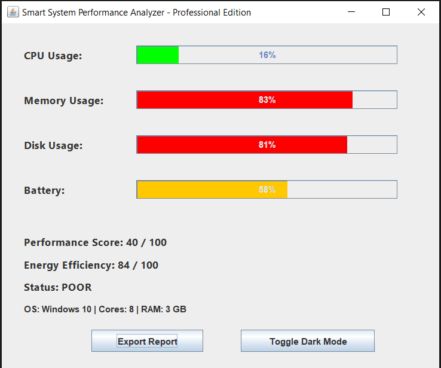

# Smart System Performance Analyzer

A Java-based desktop application that monitors real-time system performance using a graphical user interface built with Swing.

---

## 🚀 Features

- Real-time CPU usage monitoring
- Memory usage tracking
- Disk usage monitoring
- Performance score calculation
- Energy efficiency indicator
- Export performance report (TXT)
- Executable JAR file for easy deployment
- Lightweight and platform independent

---

## 🛠 Technologies Used

- Java SE
- Swing (GUI)
- OOP Concepts
- Java ManagementFactory API
- Runtime System APIs

---

## 🎯 Problem Statement

Modern systems often run multiple applications simultaneously, causing high CPU, memory, and disk usage. Users lack simple tools to monitor system performance and identify optimization opportunities.

---

## 💡 Solution

Smart System Performance Analyzer collects real-time system metrics and presents them in an easy-to-understand graphical interface. It calculates system efficiency and provides optimization insights.

---

## ▶ How to Run

### Run using JAR:
```
java -jar PerformanceMonitor.jar
```

### Run from source:
```
javac PerformanceMonitor.java
java PerformanceMonitor
```

---

## 📸 Application Screenshot



---

## 📄 License

This project is licensed under the MIT License.

---

### Developed by
Dandu Aruna
